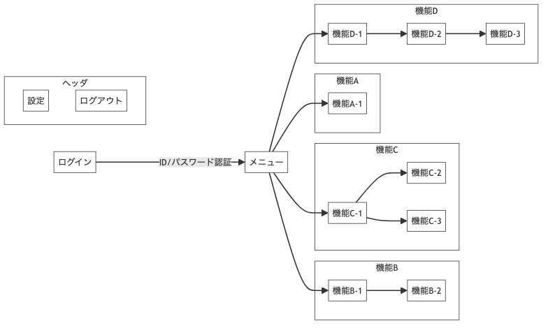

# 画面遷移図


---

### 画面遷移図出力方法

mmdファイル(またはmermaidファイル)にマーメイドを記述して保存<br>

**mmdファイルをpngに変換**<br>
-i:入力するmmdファイル<br>
-o:出力ファイル<br><br>
※拡張子を変えればsvg,pdfにも変換可能<br>

```shell
npm run mmdc
```

上記コマンドを実行するとpngファイルが出力されます。<br>

mermaid記法については[こちら](https://zenn.dev/kento_mm_ninw/articles/8b10afdbef306a)参照
