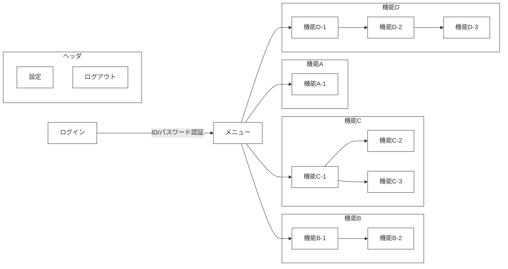

```mermaid
graph LR

  classDef default fill: #fff,stroke: #333,stroke-width: 1px;
  style funcA fill: #fff,stroke: #333,stroke-width: 1px;
  style funcB fill: #fff,stroke: #333,stroke-width: 1px;
  style funcC fill: #fff,stroke: #333,stroke-width: 1px;
  style funcD fill: #fff,stroke: #333,stroke-width: 1px;
  style header fill: #fff,stroke: #333,stroke-width: 1px;

  ログイン--ID/パスワード認証-->メニュー

  メニュー-->機能A-1
  メニュー-->機能B-1
  メニュー-->機能C-1
  メニュー-->機能D-1

  subgraph funcA [機能A]
    機能A-1
  end

  subgraph funcB [機能B]
    機能B-1-->機能B-2
  end

  subgraph funcC [機能C]
    機能C-1-->機能C-2
    機能C-1-->機能C-3
  end

  subgraph funcD [機能D]
    機能D-1-->機能D-2-->機能D-3
  end

  subgraph header [ヘッダ]
    設定
    ログアウト
  end
```